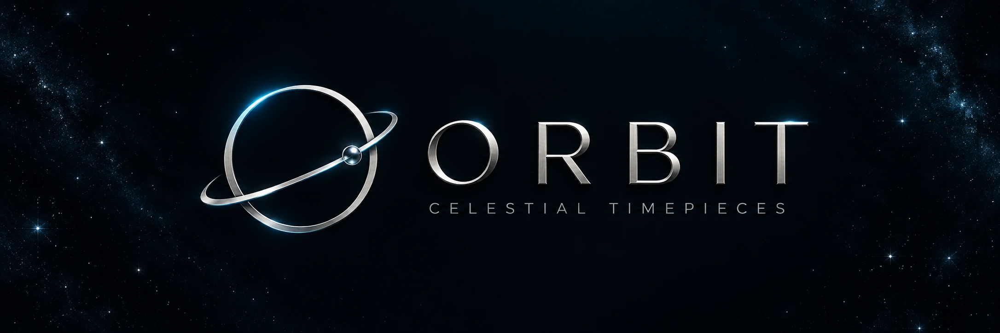

<p align="center">
  
</p>

<p align="center"><strong>SIX WORLDS. ONE UNIVERSE. YOUR ORBIT.</strong></p>
<p align="center">An immersive, scroll-driven 3D watch experience.<br>Designed on Earth. Inspired by everything beyond it.</p>
<p align="center">
  <a href="https://orbit-celestial-watches.vercel.app/">
    
  </a>
</p>
<p align="center"><a href="https://orbit-celestial-watches.vercel.app/">orbit-celestial-watches.vercel.app</a><br><sub>Enter the collection · Explore six worlds · Inspect every detail</sub></p>

<p align="center"><strong>Made at the HackFest 2026 Bootcamp</strong><br>Created by <a href="https://github.com/jesvinmmathew-sys">Jesvin M. Mathew</a></p>

---

## Time beyond Earth

ORBIT turns a watch collection into a journey through space. Six distinct timepieces float through a nebula, move with your scroll, and reveal their mechanical details in an interactive 3D viewer. Spacious typography, reflective materials, and drifting particles bring the collection together in one continuous page.

The watches are procedural 3D models built in JavaScript, with geometry for cases, bezels, straps, hands, and mechanical details.

## The celestial collection

| Edition | Design signature | Character |
| :--- | :--- | :--- |
| **01 · Earth** | Electric blue, open-work dial, exposed gears | The blue marble |
| **02 · Jupiter** | Copper chronograph, tobacco dial, espresso strap | Quiet power |
| **03 · Saturn** | Rose gold, zodiac dial, crescent moon | An orbital instrument |
| **04 · Luna** | Graphite, crater texture, yellow accents | Lunar precision |
| **05 · Neptune** | Twin domed displays, sculptural steel case | A different dimension |
| **06 · Mars** | Copper bridges, skeleton movement, ruby-colored pivots | The mechanical frontier |

## Built to explore

- **Scroll through space** — timepieces follow smooth flight paths between chapters.
- **Look beneath the surface** — a detail sequence separates the watch into layers.
- **Take control** — open an edition, drag to rotate, and scroll to zoom.
- **Feel the atmosphere** — nebula imagery, moving 3D particles, and animated mechanics create depth.
- **Set your pace** — pause ambient motion; reduced-motion preferences are supported.
- **Explore on any screen** — responsive layouts adapt the journey for desktop and mobile.

## Run the experience

**[Launch ORBIT in your browser →](https://orbit-celestial-watches.vercel.app/)**

Prefer to explore the code locally? Follow the steps below.

No build step or package installation is required. With Git and Python installed:

```sh
git clone https://github.com/jesvinmmathew-sys/orbit-celestial-watches.git
cd orbit-celestial-watches
python -m http.server 8000
```

Open **[localhost:8000](http://localhost:8000)** in a WebGL-capable browser. Internet access is needed for the Google Fonts; the 3D library and scene assets are bundled locally.

| Control | Action |
| :--- | :--- |
| Scroll the page | Travel through the collection |
| Edition navigation | Jump to a watch chapter |
| **Inspect** | Open the interactive 3D viewer |
| Drag inside the viewer | Rotate the timepiece |
| Scroll inside the viewer | Zoom in or out |
| **Reset view / Next edition** | Reset the camera pose or explore another model |
| Ambient motion button | Pause or resume background movement |

## Under the dial

| Layer | Technology |
| :--- | :--- |
| Structure | Semantic HTML |
| Visual design | CSS, responsive layouts, Inter and Instrument Serif |
| Interaction | Vanilla JavaScript |
| 3D rendering | Three.js exposed by bundled A-Frame 1.8.0 |
| Animation | `requestAnimationFrame`, scroll-linked poses, eased interpolation |

```text
index.html                 Page sections and watch inspector
styles.css                 Layout, typography, and responsive styling
main.js                    Procedural models, animation, and interaction
assets/aframe.min.js       Bundled 3D library
assets/nebula.webp         Space background
assets/logo.webp           Website brand mark
docs/images/orbit-banner.webp  README brand artwork
```

## Project credits

**Made at the HackFest 2026 Bootcamp** as a celestial watch design study by **Jesvin M. Mathew**.

This is a concept collection, not a functioning shop. Watch designs draw inspiration from supplied references without reproducing their brand marks. The watches are built procedurally; the nebula and README brand artwork are AI-generated.

A-Frame is a third-party dependency distributed under its [MIT license](https://github.com/aframevr/aframe/blob/v1.8.0/LICENSE).

---

<p align="center"><strong>ORBIT</strong><br><sub>TIME BEYOND EARTH · HACKFEST 2026 BOOTCAMP</sub></p>
